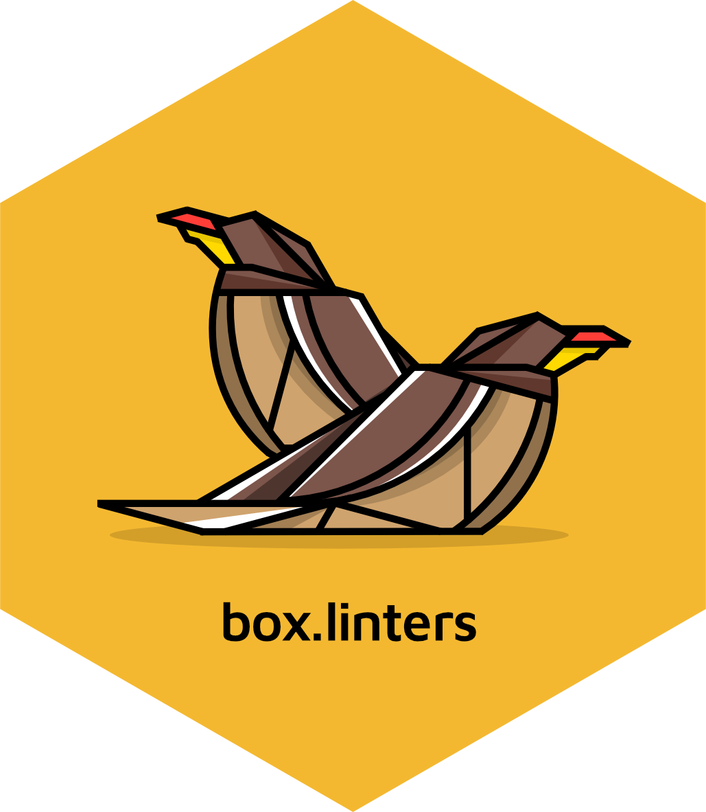

# box.linters <a href="https://appsilon.github.io/box.linters/"></a>

> _lintr-compatible linters for box modules in R_

<!-- badges: start -->
[](https://cran.r-project.org/package=box.linters)
[](https://github.com/Appsilon/box.linters/actions/workflows/ci.yml)
[](https://app.codecov.io/gh/Appsilon/box.linters)
<!-- badges: end -->

`box.linters` is an R package that provides the [`{lintr}` package](https://github.com/r-lib/lintr/) compatibility with [`{box}` package](https://github.com/klmr/box) modules. In addition to providing code-styling checks for `box::use()` function calls, `box.linters` includes a collection of linter functions to replace [`lintr::object_usage_linter()`](https://lintr.r-lib.org/reference/object_usage_linter.html).

While the primary purpose of `{box.linters}` is for use with the  [`{rhino}`](https://appsilon.github.io/rhino/) package, its functions and features are available for use with any R code or project that uses the `{box}` package for modular R code.

## Motivation

`lintr::object_usage_linter` is not compatible with `{box}` modules.

```r
# use of box modules
box::use(
  stringr[...]
)

some_function <- function() {
  str_trim("  String with trailing and leading white space\t")
}
```

```
> lintr::lint(box-module.R)
<text>:6:3: warning: [object_usage_linter] no visible global function definition for 'str_trim'
  str_trim("  String with trailing and leading white space ")
  ^~~~~~~~
```

In order to use `lintr` and `box` together, it was necessary to disable `lintr::object_usage_linter()`:

```r
lintr::lint(box-module.R,
            linters = lintr::linters_with_defaults(object_usage_linter = NULL))
```

However, this meant we lose the functionality provided by `lintr::object_usage_linter()`.

## Installation

Stable version:

```r
install.packages("box.linters")
```

Development version:

```r
# install.packages("remotes")
remotes::install_github("Appsilon/box.linters")
```

## Usage

Create a configuration file and run selected linters:

### .lintr setup

```r
# create a .lintr file
box.linters::use_box_lintr()

# a file:
lintr::lint(filename.R)

# in a project:
lintr::lint_dir()
```

### Manually

Or, use `box.linters` manually with `lintr`:

```r
# a file:
lintr::lint(filename.R, linters = box.linters::box_default_linters)

# in a project:
lintr::lint_dir(linters = box.linters::box_default_linters)
```

### Rhino

Or, use `box.linters` from within a `{rhino}` project:

```r
# a .lintr file should already exist when a rhino project is created
# box.linters::use_box_lintr(type = "rhino")

# in a rhino project:
rhino::lint_r()
```


## Contribute

If you want to contribute to this project, please submit a regular PR, once you're done with the new feature or bug fix.

Reporting a bug is also helpful - please use [Github issues](https://github.com/Appsilon/box.linters/issues) and describe your problem as detailed as possible.

## Appsilon


Appsilon is a **Posit (formerly RStudio) Full Service Certified Partner**.<br/>
Learn more at [appsilon.com](https://appsilon.com).

Get in touch [opensource@appsilon.com](mailto:opensource@appsilon.com)

Explore the [Rhinoverse](https://rhinoverse.dev) - a family of R packages built around [Rhino](https://appsilon.github.io/rhino/)!

<a href = "https://appsilon.us16.list-manage.com/subscribe?u=c042d7c0dbf57c5c6f8b54598&id=870d5bfc05" target="_blank">
  
</a>
